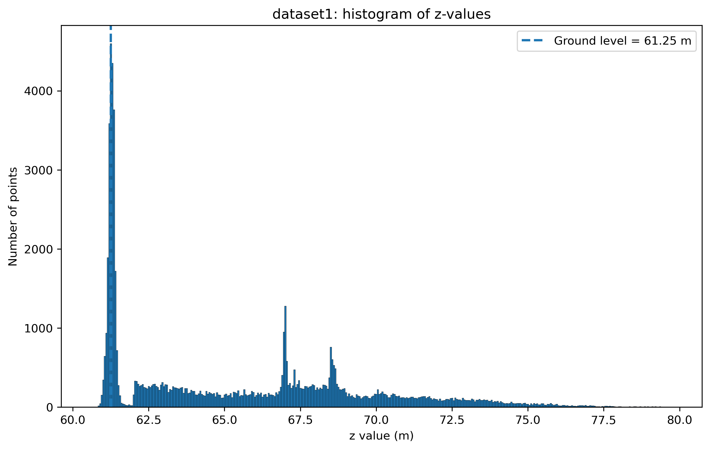
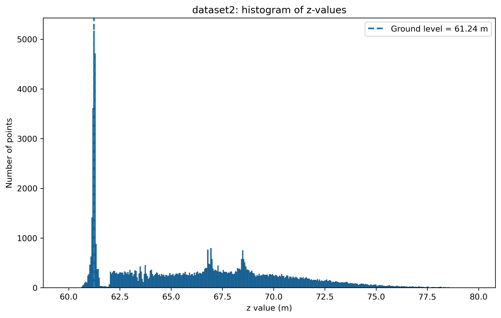
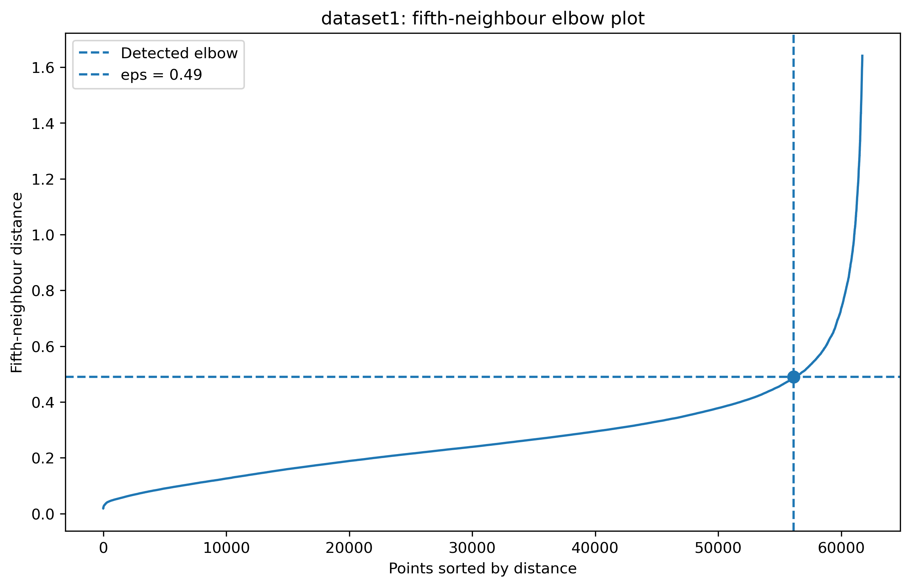
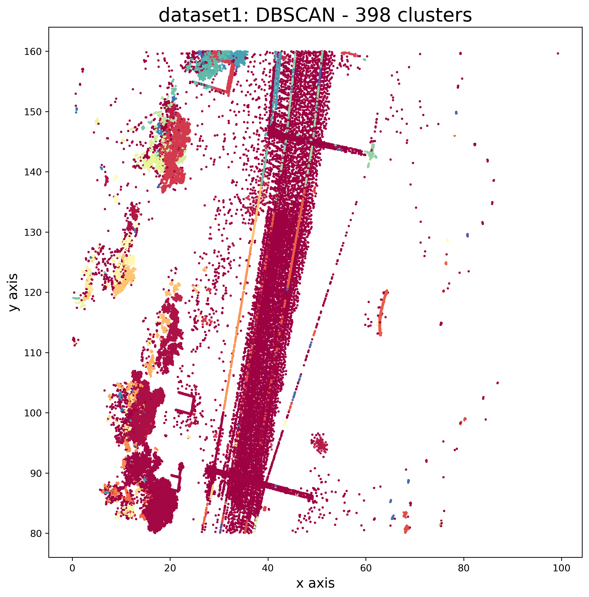
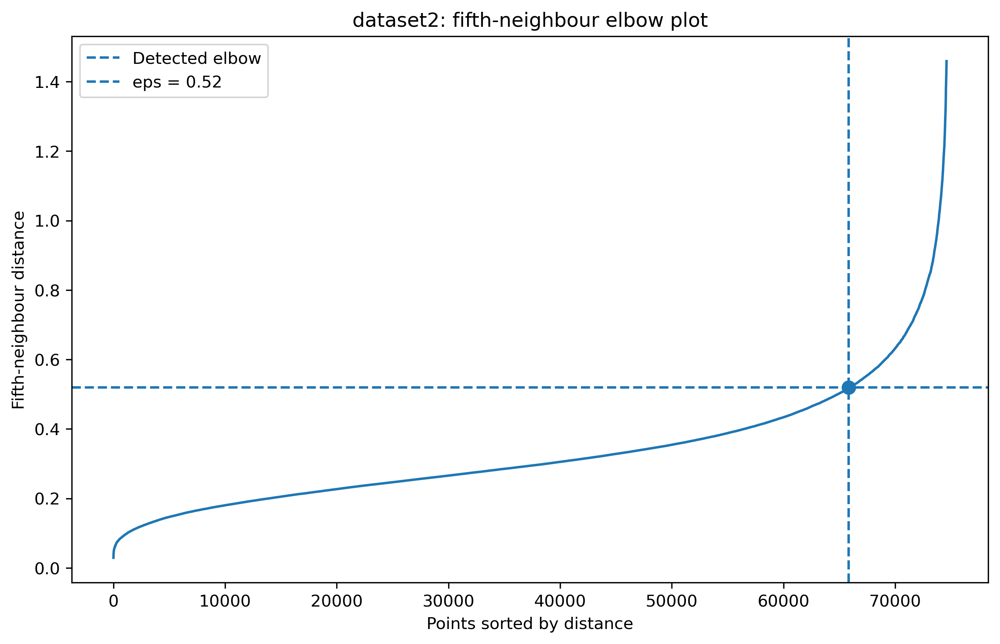
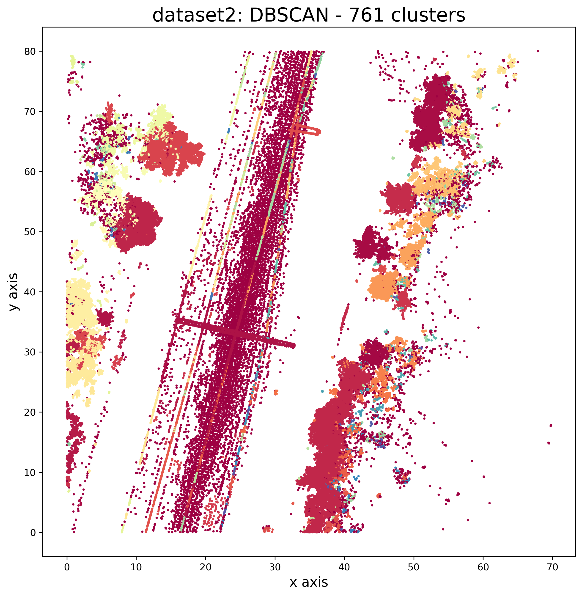
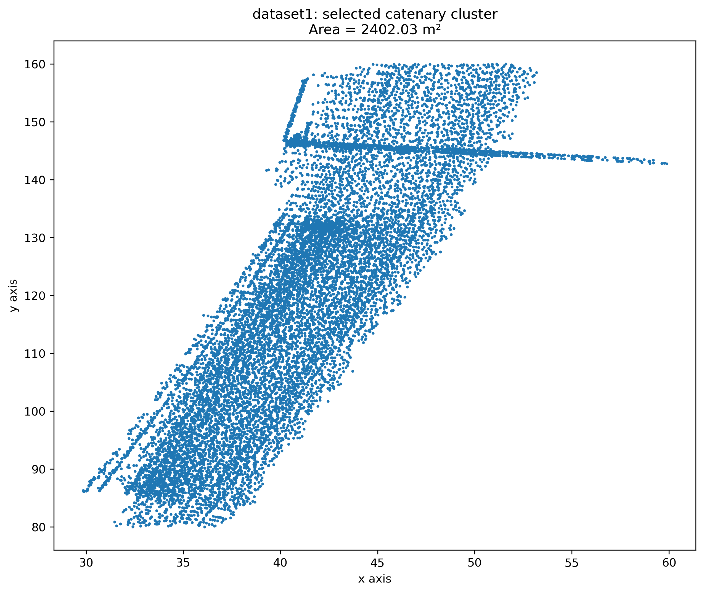
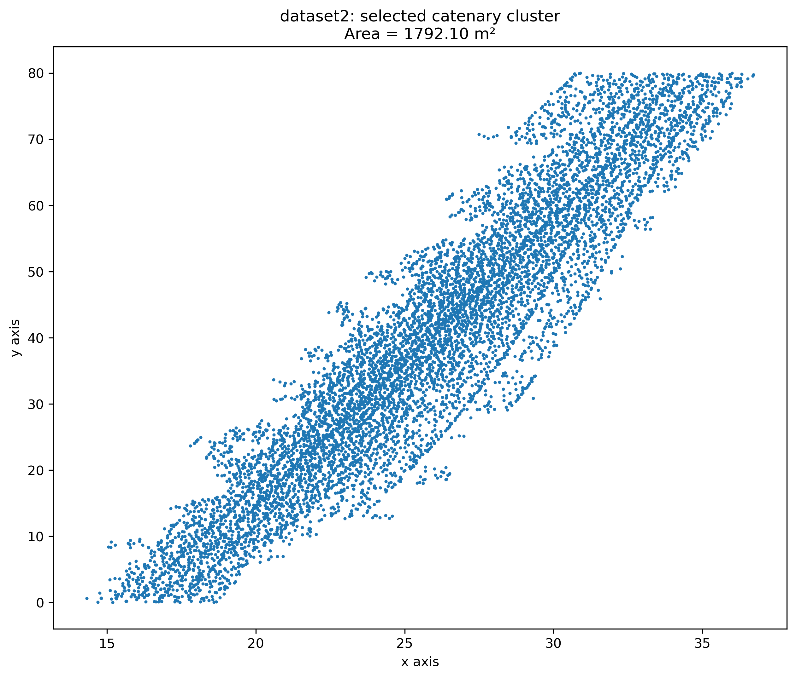

# Industrial AI for Structural Health Monitoring

Student: Chris Lubert

This project processes point cloud data (PCD) for structural health monitoring using Python.

The project consists of three tasks:

1. Ground level estimation using histograms.
2. DBSCAN clustering using an automatically Selected epsilon value.
3. Detection of the catenary by selecting the largest cluster.

# Task 1 - Ground Level Estimation
Ground Level was estimated using a histogram of the z-values for each dataset.

## Results
|Dataset|Ground Level (m)|
|--------|---------------:|
|dataset1| 61.25|
|dataset2| 61.24|

### Histogram - Dataset 1

### Histogram - Dataset 2

---

# Task 2 - DBSCAN Clustering
The optimal epsilon value was determined using the fifth neighbour elbow method.

## Results
|Dataset|Optimal epsilon |
|--------|---------------:|
|dataset1| 0.49|
|dataset2| 0.52|

### Elbow Plot - Dataset 1

### Cluster Plot - Dataset 1

### Elbow Plot - Dataset 2

### Cluster Plot - Dataset 2

---

# Task 3 - Larger Cluster (Catenary)

The largest non noise cluster was selected as the catenary.

## Dataset 1

| Measurement | Value |
|------------|-------:|
| min(x)|29.85 m |
| min(y)|80.01 m |
| max(x)|59.88 m |
| max(y)|160.00 m |
| x span|30.03 m |
| y span|79.98 m |
| Area |2402.03 m²|

### Catenary

---

## Dataset 2
| Measurement | Value |
|------------|-------:|
| min(x)|14.31 m |
| min(y)|0.01 m |
| max(x)|36.72 m |
| max(y)|79.99 m |
| x span|22.41 m |
| y span|79.98 m |
| Area |1792.10 m²|

### Catenary

---

# Sumary
|Dataset|Ground Level|Optimal epsilon| Catenary Area|
|----------|---------:|--------------:|-------------:|
| dataset1 | 61.25 m | 0.49 | 2402.03 m² |
| dataset2 | 61.24 m | 0.52 | 1792.10 m² |
